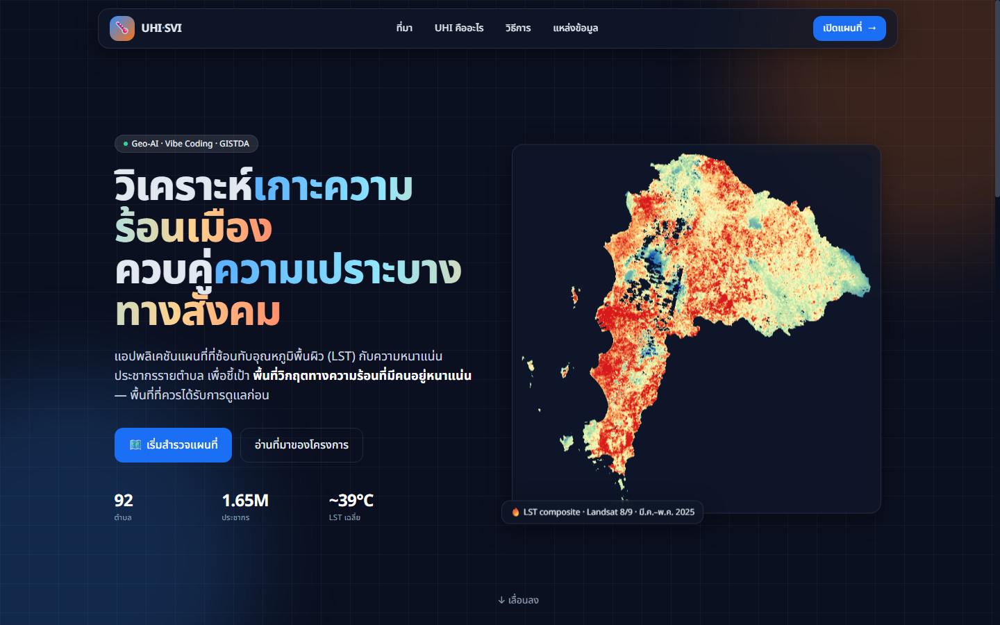
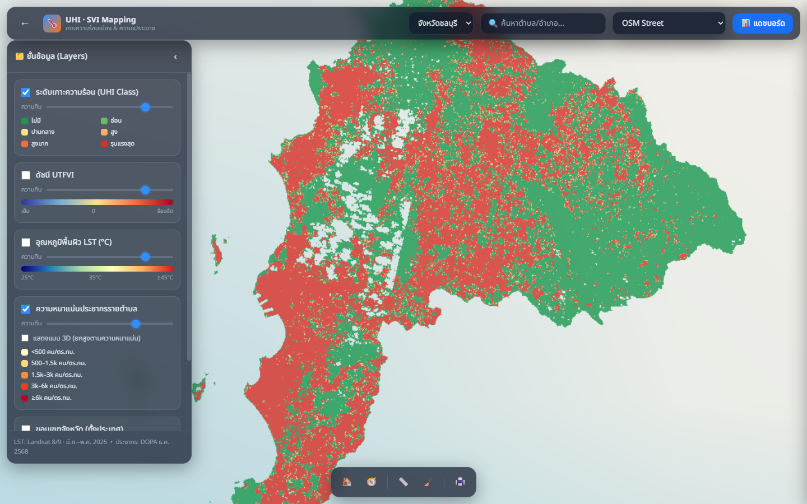
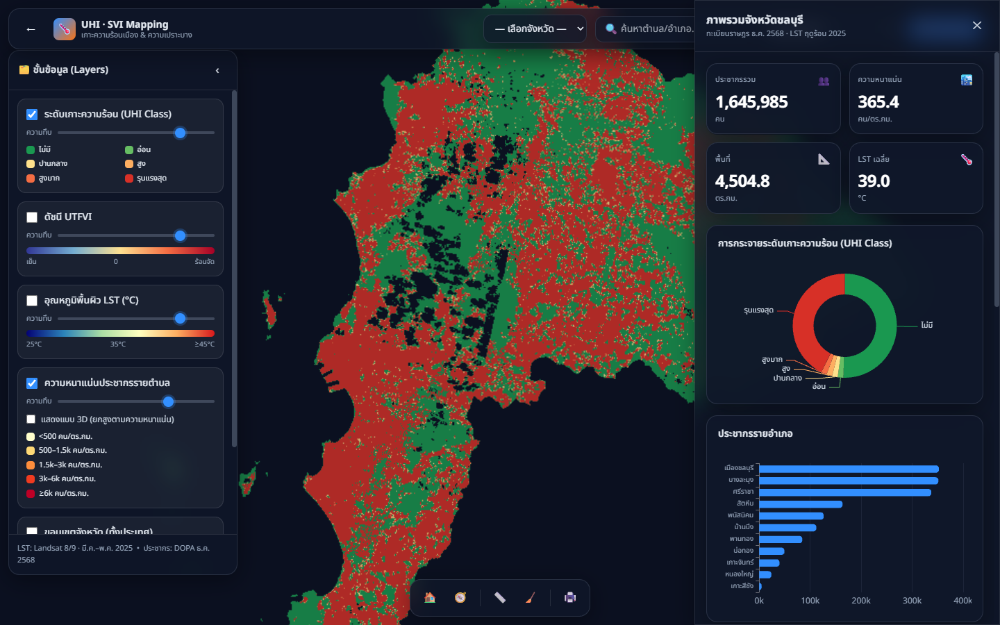

<div align="center">

# 🌡️ Urban Heat Island &amp; Social Vulnerability Mapping

**แอปพลิเคชันแผนที่ 3 มิติ วิเคราะห์เกาะความร้อนเมือง (UHI) ซ้อนทับความเปราะบางทางสังคม — จังหวัดชลบุรี**

[](https://github.com/Sukkarinatlas/uhi-svi-mapping/actions/workflows/deploy.yml)


### 🔗 [**เปิดใช้งานแอป (Live Demo)**](https://sukkarinatlas.github.io/uhi-svi-mapping/)

</div>

---

## 📖 ภาพรวม

โครงการนี้ประมวลผล **อุณหภูมิพื้นผิว (Land Surface Temperature, LST)** จากดาวเทียม Landsat 8/9
มาคำนวณดัชนีความรุนแรงของเกาะความร้อนเมือง (**UTFVI**) แล้วซ้อนทับกับ **ความหนาแน่นประชากรรายตำบล**
จากทะเบียนราษฎร เพื่อชี้เป้า *พื้นที่วิกฤตทางความร้อนที่มีประชากรอยู่หนาแน่น* — ข้อมูลที่ช่วยจัดลำดับความสำคัญ
ในการวางผังเมือง พื้นที่สีเขียว และมาตรการบรรเทาความร้อน

## ✨ คุณสมบัติเด่น

- 🗺️ **แผนที่ 3D (CesiumJS)** พร้อมมุมมองเอียง 2.5D และโหมดยกตำบลตามความหนาแน่น
- 🔥 **เลเยอร์ความร้อน** — LST, UTFVI, UHI Class (6 ระดับ) พร้อม Legend และปรับความทึบได้
- 👥 **ความหนาแน่นประชากรรายตำบล** (choropleth) + คลิกดูรายละเอียด (popup)
- 📊 **แดชบอร์ด (ECharts)** — KPI, การกระจาย UHI, ประชากรรายอำเภอ, Top-10 ตำบลร้อน/หนาแน่น
- 🔎 ค้นหาตำบล/อำเภอ · 📏 วัดระยะทาง · 🖨️ พิมพ์/บันทึกภาพแผนที่
- 🌐 แผนที่ฐานหลายชั้น — OSM, OpenTopoMap, Carto Dark, **Sphere Hybrid (GISTDA)**

## 🖼️ ภาพตัวอย่าง

| หน้า Story | แผนที่ + เลเยอร์ | แดชบอร์ด |
|:---:|:---:|:---:|
|  |  |  |

## 🧱 สถาปัตยกรรม / โครงสร้างโปรเจกต์

```
UHI_WEB/
├─ frontend/          # เว็บแอป (Vite + CesiumJS + Tailwind + ECharts)
│  ├─ index.html      #   หน้า Story
│  ├─ map.html        #   หน้าแผนที่ (?dash=1 เปิดแดชบอร์ด)
│  ├─ src/            #   map/{main,config,charts,legend,measure}.js, story/, style.css
│  └─ public/data/    #   ข้อมูลสำเร็จรูปสำหรับเว็บ (GeoJSON, PNG overlays, stats)
├─ backend/           # ไปป์ไลน์ Python เตรียมข้อมูล (scripts/ + requirements.txt)
├─ data/
│  ├─ source/         # ข้อมูลตั้งต้น (ขอบเขต shp) — ไม่รวมใน git (ดู backend/README)
│  └─ output/         # ผลลัพธ์ (Excel, GeoTIFF, GeoJSON, UHI rasters)
├─ docs/              # สถาปัตยกรรม (.drawio), แคตาล็อกข้อมูล, คู่มือ, screenshots
└─ .github/workflows/ # CI/CD deploy ขึ้น GitHub Pages
```

## 🚀 เริ่มต้นใช้งาน

> หมายเหตุ: สำหรับ frontend ต้องใช้ Node.js 22+ เนื่องจาก CesiumJS dependency มี requirement ของ Node >= 22

```bash
# frontend
cd frontend
npm install
npm run dev        # http://localhost:5173
npm run build      # สร้าง production ที่ dist/
npm run preview    # ทดสอบ production build

# backend (เตรียม/สร้างข้อมูลใหม่ — ทางเลือก)
cd backend
pip install -r requirements.txt
# ดูลำดับสคริปต์ใน backend/README.md
```

## ☁️ การ Deploy ไปยัง GitHub Pages

1. ตั้งค่า repository ให้เป็น public หากต้องการเปิดใช้งานสาธารณะได้ทันที
2. เปิด Settings → Pages → Source = GitHub Actions
3. ทุกครั้งที่ push ไปที่ `main` GitHub Actions จะ build frontend แล้ว deploy อัตโนมัติ
4. URL ของหน้า live demo จะอยู่ที่:
   `https://sukkarinatlas.github.io/uhi-svi-mapping/`

ไฟล์ workflow อยู่ที่ [`.github/workflows/deploy.yml`](.github/workflows/deploy.yml)

## 🗃️ แหล่งข้อมูล

| ชั้นข้อมูล | แหล่ง | รายละเอียด |
|---|---|---|
| LST / UTFVI / UHI Class | **Landsat 8/9 C2 L2** (Microsoft Planetary Computer) | ST_B10, มี.ค.–พ.ค. 2025, สูตรเดียวกับ Google Earth Engine |
| ประชากรรายตำบล | **DOPA** ทะเบียนราษฎร (statMONTH) | ธ.ค. 2568 · รวมทั้งจังหวัด 1,645,985 คน |
| ขอบเขตการปกครอง | **GISTDA / RTSD (COD)** | จังหวัด/อำเภอ/ตำบล |
| แผนที่ฐาน | OSM · OpenTopoMap · CARTO · GISTDA Sphere | |

## ☁️ การ Deploy

ทุกครั้งที่ push ขึ้น `main` — GitHub Actions จะ `npm run build` แล้ว deploy โฟลเดอร์ `frontend/dist`
ขึ้น **GitHub Pages** อัตโนมัติ (ดู [`.github/workflows/deploy.yml`](.github/workflows/deploy.yml))

## 📄 License

MIT · จัดทำเพื่อการศึกษา — *GISTDA GeoAI &amp; Vibe Coding Material*

## 🙏 เครดิต

USGS/NASA Landsat · Microsoft Planetary Computer · กรมการปกครอง (DOPA) · GISTDA · OpenStreetMap · CesiumJS
